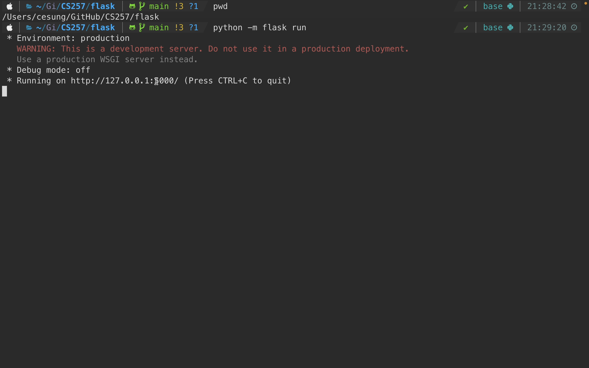
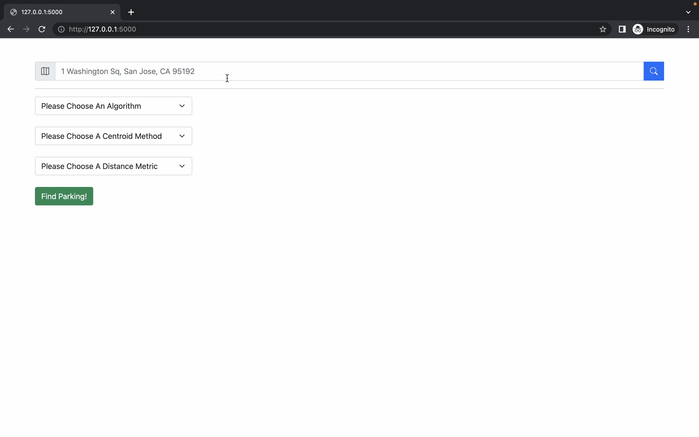
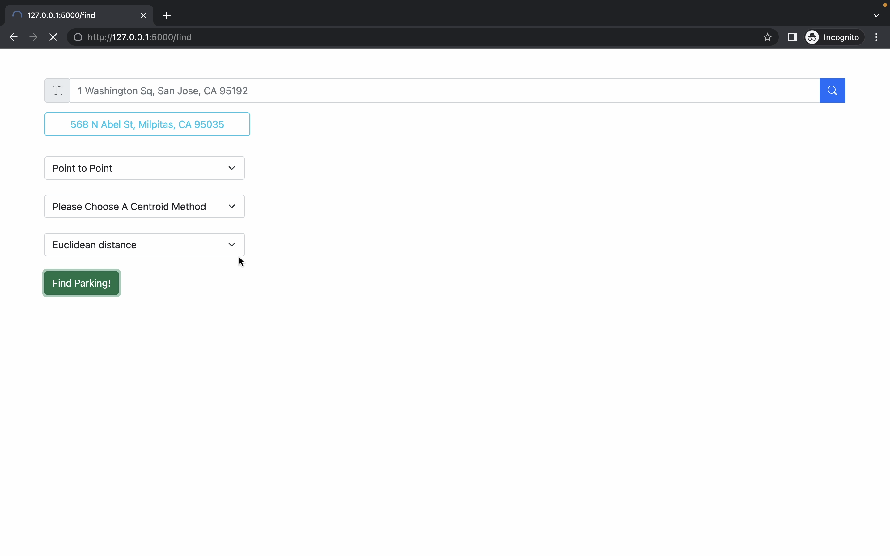
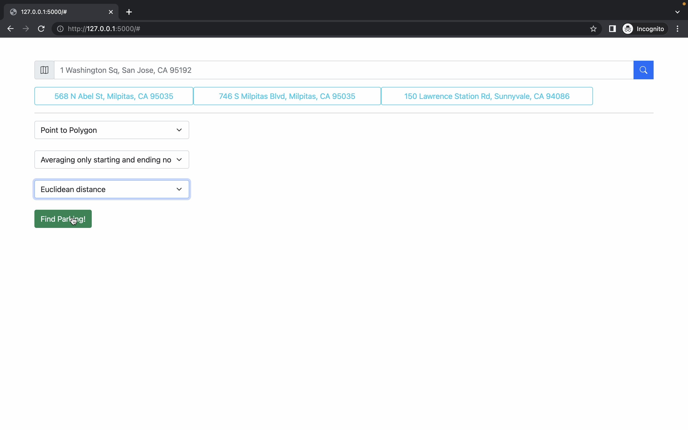
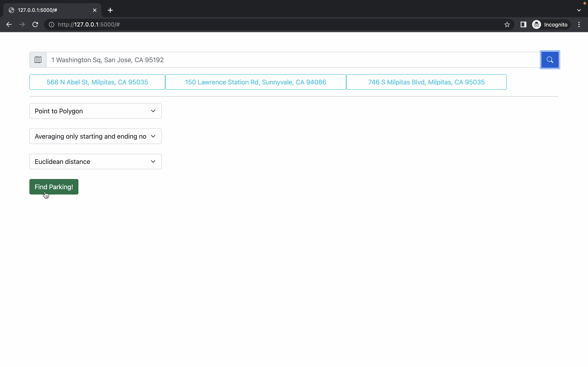

# CS257 ParkingLotSearchApp
The project is created as part of coursework for CS 257 (SJSU)

### Requirements<br>
Before compiling, please ensure that the following requirements are fulfilled:<br>
Python v3.10 or higher<br>
pip v23 or higher<br>

### Cloning the repository<br>
Run this command in a running terminal window:<br>
git clone https://github.com/daman-150191/CS257.git ParkingLotSearchApp<br>
Then navigate to the project root directory: <br>
cd ParkingLotSearchApp

### Installing dependencies<br>
From the project root directory, run the following CLI: <br>
pip install -r requirements.txt

### Compilation<br>
The entrypoint for this project is flask/app.py. It can be run from the command line from the project root directory as follows: <br>
```shell
python flask/app.py
```
or setting up the FLASK_APP enviroment variable to specify how to load the application
```shell
cd flask
export FLASK_APP=app
python -m flask run
```

### CLI Example Usage 
Explore the whole folder structure
```shell
tree .
```
The result should look like following
```shell
.
├── README.md
├── data
│   ├── POIs.txt
│   ├── parking_lot.xlsx
│   └── parking_lot_db.xlsx
├── flask
│   ├── API_KEY.txt
│   ├── __pycache__
│   │   └── app.cpython-39.pyc
│   ├── app.py
│   ├── properties.ini
│   └── templates
│       ├── form.html
│       └── google_map.html
├── requirements.txt
└── src
    ├── API_KEY.txt
    ├── DBHandler.py
    ├── __pycache__
    │   ├── DBHandler.cpython-39.pyc
    │   └── find_parking.cpython-39.pyc
    ├── find_parking.py
    ├── nearby_search.py
    └── properties.ini

6 directories, 18 files
```

Go to `src` folder by typping
```shell
cd src
```

Available parameters for the `find_parking` script
```shell
python find_parking.py --help
```

```shell
usage: find_parking.py [-h] (-p POLYGON [POLYGON ...] | -f FILENAME)
                       [-c {avg,avg_start_end}] -a {p2point,p2poly} -m
                       {euc,hav}

Find the name and coordinate of the nearest parking lot given a list of POIs

optional arguments:
  -h, --help            show this help message and exit
  -p POLYGON [POLYGON ...], --polygon POLYGON [POLYGON ...]
                        Specify POI(s) with 1+ of coordinates with the format
                        of "LAT,LNG", where comma separate latitude and
                        longitude of each coordinate tuple
  -f FILENAME, --filename FILENAME
                        Read a list of POIs from file with each POI a separate
                        line of physical address
  -c {avg,avg_start_end}, --centroid {avg,avg_start_end}
                        Algorithms to abstract a list of POIs into a centroid
                        node
  -a {p2point,p2poly}, --algorithm {p2point,p2poly}
                        Algorithms to measure the distance
  -m {euc,hav}, --method {euc,hav}
                        Distance calculation methods for point-to-point
                        approach
```

#### Find closest parking from file

Explore the sample POIs file under `../data/POI.txt`. To see the sample addresses, simply typing
```shell
cat ../data/POIs.txt
```
The three sample addresses are showing below:
```shell
150 Lawrence Station Rd, Sunnyvale, CA 94086
746 S Milpitas Blvd, Milpitas, CA 95035
568 N Abel St, Milpitas, CA 95035
```

To find the closest parking lot from file, type the following command
```shell
python find_parking.py --algorithm p2point --filename ../data/POIs.txt --method euc
```

#### Find closest parking from manual input coordinates

```shell
python find_parking.py --algorithm p2point --polygon "37.392109, -122.038797" "37.387970, -122.020247" "37.372724, -122.014402" "37.363737, -122.033207" "37.381869, -122.043106" --centroid avg_start_end --method euc
```

#### Find closest parking with centroid parameter

Centroid method 1: averaging all
```shell
python find_parking.py --centroid avg --algorithm p2point --filename ../data/POIs.txt --method euc
```

Centroid method 2: averaging starting/ending POI
```shell
python find_parking.py --centroid avg --algorithm p2point --filename ../data/POIs.txt --method euc
```

#### Excluded rule to the source of input
The POIs can only be given in either of the following two format
* By file using the `-f/--filename` parameter
* By manual input coordinates, which in the format of `"LAT,LNG"` using the `-p/--polygon` parameter

If you try to give both parameters at the same time:
```shell
python find_parking.py --algorithm p2point --filename ../data/POIs.txt --polygon "37.392109, -122.038797" "37.387970, -122.020247" "37.372724, -122.014402" "37.363737, -122.033207" "37.381869, -122.043106" --centroid avg_start_end --method euc
```

You will get the error like following:
```shell
usage: find_parking.py [-h] (-p POLYGON [POLYGON ...] | -f FILENAME)
                       [-c {avg,avg_start_end}] -a {p2point,p2poly} -m
                       {euc,hav}
find_parking.py: error: argument -p/--polygon: not allowed with argument -f/--filename
```

### GUI Example Usage

Go to `flask` folder by typping
```shell
cd flask
```

Run the flask application by typing
```shell
python app.py
```
or after setting up the FLASK_APP enviroment variable
```shell
python -m flask run
```



Find closest parking lot on single POI with following parameters
* Algorithm: Point-to-Point
* Centroid(optional parameter): None 
* Distance Metric: Euclidean distance




Find closest parking lot on multiple POIs with following parameters
* Algorithm: Point-to-Polygon
* Centroid(optional parameter): Average starting/ending POIs
* Distance Metric: Euclidean distance




Using the same parameters but changing the order of POI from

```shell
568 N Abel St, Milpitas, CA 95035
746 S Milpitas Blvd, Milpitas, CA 95035
150 Lawrence Station Rd, Sunnyvale, CA 94086
```

to

```shell
568 N Abel St, Milpitas, CA 95035
746 S Milpitas Blvd, Milpitas, CA 95035
150 Lawrence Station Rd, Sunnyvale, CA 94086
```




### Team Members<br>
Cheng-En Sung <br>
Damanpreet Kaur <br>
Gargi Sheguri

### Work Distribution<br>
**Cheng-En Sung:<br>**
1. Data Collection: Use of Google Maps API to collate parking lot coordinates
2. Algorithm Implementation: Point-to-polygon distance calculation
   1. Centroid averaging all nodes
   2. Centroid averaging start and end nodes
3. Web Application: 
   1. Flask web app application development
   2. Google Earth UI integration
   3. Backend setup (including user-friendly CLI)
4. Architecture design
5. Schema design
6. End-to-end troubleshooting
7. Documentation
8. Milestone Status Report
9. Final Status Report 

**Damanpreet Kaur<br>**
1. Backend Setup: AWS RDS setup, deployment, and maintenance
2. Web Application:  
   1. UI development
   2. Integrated UI with Flask app
3. Architecture design
4. Schema design
5. End-to-end troubleshooting
6. Documentation
7. Milestone Status Report
8. Final Status Report
9. Final presentation ppt 

**Gargi Sheguri**
1. Algorithm Implementation: Point-to-point distance calculation
   1. Euclidean distance calculation
   2. Haversine distance calculation
2. Web Application: 
   1. Integrated Python middleware with AWS RDS backend
   2. UI troubleshooting
3. Architecture design
4. Schema design
5. End-to-end troubleshooting
6. Documentation
7. Milestone Status Report
8. Final Status Report
9. Final presentation ppt
